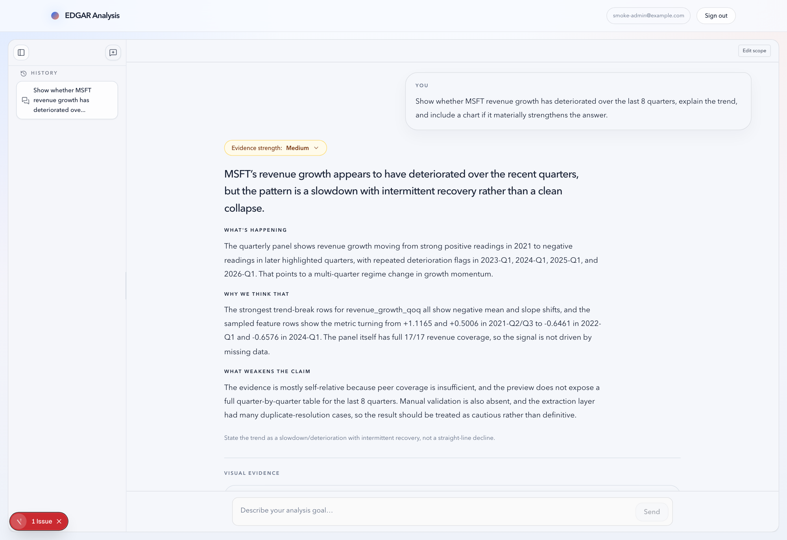
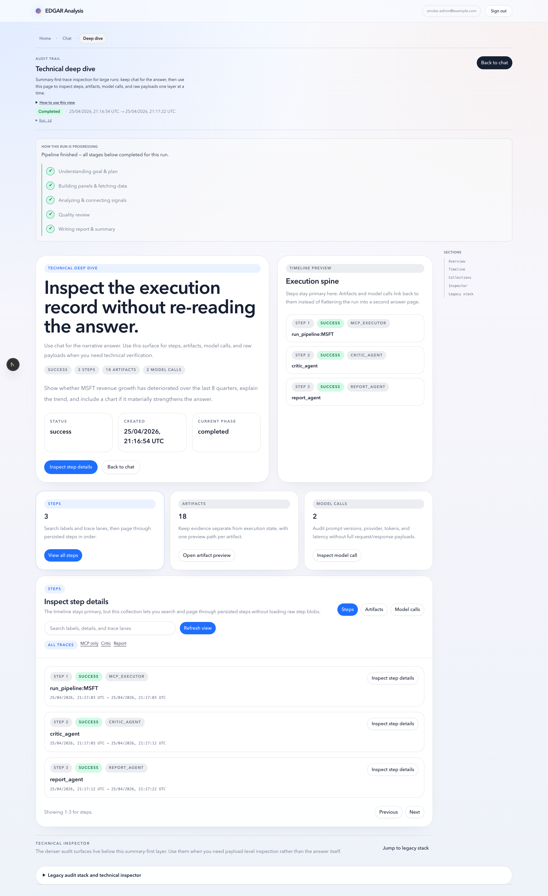
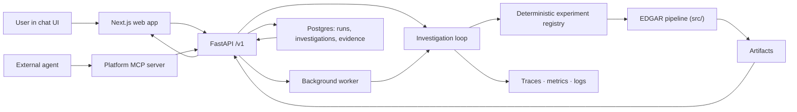

# EDGAR Analysis


EDGAR Analysis is a chat-first financial analysis system built on top of SEC EDGAR data. It combines a deterministic numerical pipeline, a FastAPI control plane, a background worker, and a Next.js interface so you can ask a question like:

> Is MSFT showing persistent deterioration in revenue growth and margin quality over the last 8 quarters?

and get back:

- a readable narrative answer
- inline evidence and charts
- traceable artifacts and run history
- deterministic, inspectable numerical outputs underneath

The core design goal is simple:

**Every analysis run should be trustworthy, inspectable, and reproducible.**

## Status

This is an actively developed v1.x system.

Stable:

- deterministic EDGAR pipeline
- chat UI with persisted runs and artifacts
- evaluation and regression framework
- agentic investigation loop: observability, budgets, replay/diff
- agency evaluation that discriminates: on its hard tier the deterministic baseline scores 0%
  and `gpt-5.4-mini` 60%, stable across five trials — see
  [the scoreboard](docs/agent/agency-scoreboard.md)
- multi-claim investigations: a two-part question raises a claim per clause, each measured on
  its own metric, and a split outcome is reported as `mixed` rather than rounded to the
  supported half

Known limits, stated plainly:

- The agentic engine is **flag-gated and off by default**
  (`EDGAR_BACKEND_AGENTIC_ENGINE_ENABLED`); the deterministic EDGAR chain remains the
  default execution path.
- The agency suite covers two of the loop's four model-backed decisions. A case for
  `select_experiment` is not fairly constructible, because `expected_information_gain` is fixed
  by the planner's tool ordering —
  [documented here](docs/agent/agency-evaluation.md#what-the-tier-does-not-cover).
- On the benchmark case where the honest answer is "this data cannot answer that",
  `gpt-5.4-mini` substitutes the nearest available metric and reports confidence 0.95 —
  behaviour indistinguishable from the rule-engine baseline.
- Asked a two-clause question, `gpt-5.4-mini` misreads it rather than answering half: it read
  "is growth slowing *and* is margin holding up?" as a ranking problem and concluded
  insufficient evidence. The loop can now investigate both clauses; the model does not ask it to.
- The hosted MCP endpoint has no rate limiting, and its handshake/tool-listing is
  unauthenticated (tool *invocation* is not).
- No CD pipeline, backup/restore runbook, or deployment target beyond single-host Compose.

In progress:

- expanded ticker coverage
- hosted demo environment
- extended benchmark suites
- a hard-tier case for `select_experiment`, the one model-backed decision the suite still
  cannot fairly probe

## Product Screens

### Narrative answer with supporting evidence


### Inline chart evidence inside chat



### Deep-dive trace and inspection surface



### Agent loop observability


A **seeded local run**: 210 investigations over 30 minutes against `gpt-5.4-mini`, $0.80 of
tracked spend. Not production traffic — reproduce it yourself with
[`scripts/seed-agent-activity.py`](scripts/seed-agent-activity.py), documented under
[Populating the dashboard](docs/observability.md#populating-the-dashboard).

The panels are built to answer whether the loop is actually *working*, and here they show it is:
**median iterations 1.4** (it iterates rather than one-shotting), **seven distinct tools** with
the mix shifting by goal (it adapts rather than running a fixed script), and hypothesis
transitions including `→ rejected` (its own evidence overturns its claims). Decision latency
separates the four model-backed components at ~2s from the six deterministic ones at ~5ms.

`Component errors` and `Experiment failure rate by tool` read "No data" because nothing failed
across those 210 runs. Left as-is rather than manufactured.

## Why this repo matters

Most AI-finance demos stop at “LLM says something plausible.” This repo is different:

- **Deterministic numerical path**: the core EDGAR normalization, feature engineering, anomaly detection, peer signals, and trend-break logic live in [`src/`](src/), not inside a black-box model call.
- **Traceable answers**: the chat UI is a product surface over persisted runs, artifacts, and transparency metadata, not an unlogged chat transcript.
- **Evidence-first architecture**: every answer can be traced to stored artifacts, critic/report summaries, and explicit run outputs.
- **Brownfield-ready stack**: FastAPI, SQLAlchemy, Postgres, background worker, and Next.js are already wired together for a real multi-user product path.

## What the product does

- Ask company-level or peer-relative financial questions in a chat UI
- Route prompts deterministically into supported EDGAR analysis plans
- Generate narrative answers with confidence and supporting evidence
- Render inline charts when the backend has safe, deterministic chart previews
- Preserve runs, artifacts, traceability, and audit surfaces for later inspection

## The agentic investigation loop

Alongside the fixed EDGAR pipeline, the platform runs an **adaptive investigation loop**
([`agentic/`](agentic/)) that behaves like an analyst rather than a script: it interprets a
goal, proposes hypotheses, chooses experiments based on what it has learned so far, revises
claims when the evidence contradicts them, and stops for an explicit, typed reason.

The division of labor is the point: **the model plans and interprets; deterministic code
computes.** No number in an answer is produced by a model.

| | |
|---|---|
| **Observable** | Every decision emits an OpenTelemetry span (`agent.investigation → agent.iteration.N → agent.component.{name}`), a structured log, and Prometheus metrics — outcomes, per-component latency, hypothesis transitions, experiment mix, model spend. `docker compose -f docker-compose.yml -f docker-compose.observability.yml up` brings up Prometheus, Grafana (with a committed dashboard), and Jaeger. → [docs](docs/observability.md) |
| **Bounded** | Explicit budgets on experiments, iterations, wall time, and estimated cost, with deterministic safety caps above them. |
| **Reproducible** | Deterministic IDs and per-iteration checkpoints; a resumed run reaches the same state as an uninterrupted one. |
| **Comparable** | [Replay](docs/agent/replay-and-diff.md) a persisted investigation under a different model, prompt, or budget and diff the outcome — did the analysis change, or only the route to it? |
| **Measured** | [`suite_agency_v1`](docs/agent/agency-evaluation.md) scores *reasoning quality* — does it conclude when evidence supports it, revise when contradicted, decline when it cannot? Run `python -m agentic.evaluation`. |

The loop is input-agnostic: it reasons over **roles declared by an adapter**, never over
column names. The agency suite includes weather-station and service-latency datasets whose
columns share nothing with the financial fixtures.

## Integration surfaces

Everything goes through the `/v1` API — there is no privileged back door, which is why the MCP
server can be hosted safely.

- **HTTP API** — committed OpenAPI contract at [`docs/api/openapi.json`](docs/api/openapi.json),
  enforced in CI. → [contract docs](docs/api/README.md)
- **Platform MCP server** — commission investigations and read hypotheses, evidence, and
  artifacts as MCP tools and resources. Runs over stdio or hosted streamable-HTTP with
  per-caller bearer auth. → [docs](docs/mcp-platform-server.md)
- **EDGAR MCP server** — the deterministic computation tools. → [`edgar_project/mcp/`](edgar_project/mcp/)
- **Extending it** — add an input adapter, an experiment tool, or a decision policy.
  → [guide](docs/extending.md)

## Product architecture



Both MCP servers and the web app are clients of the same `/v1` API, so authentication and
owner scoping apply identically to all of them.

## Tech stack

- **Backend**: FastAPI, SQLAlchemy, Alembic, Postgres
- **Worker**: Python background execution loop with persisted jobs and leases
- **Frontend**: Next.js App Router, React, Tailwind
- **Pipeline**: deterministic Python EDGAR processing in [`src/`](src/)
- **Agent loop**: adaptive investigation engine in [`agentic/`](agentic/) (domain model, adapters, deterministic experiment registry)
- **MCP**: EDGAR computation tools in [`edgar_project/mcp/`](edgar_project/mcp/); the platform itself in [`backend/mcp/`](backend/mcp/)
- **Observability**: structlog + OpenTelemetry + Prometheus, with a committed Grafana dashboard and alert rules in [`ops/`](ops/)
- **Evaluation**: output benchmarks in [`edgar_project/evaluation/`](edgar_project/evaluation/); agency scoring in [`agentic/evaluation/`](agentic/evaluation/)

## 5-minute quickstart

### 1. Configure local secrets

From the repository root:

```bash
cp .env.example .env
```

Set these values in `.env`:

- `EDGAR_BACKEND_JWT_SECRET`
- `EDGAR_BACKEND_OPS_API_TOKEN`
- `EDGAR_BACKEND_BOOTSTRAP_ADMIN_TOKEN`

### 2. Start the full stack

```bash
docker compose up --build
```

App endpoints:

- Web: [http://127.0.0.1:3000](http://127.0.0.1:3000)
- API health: [http://127.0.0.1:8000/v1/health](http://127.0.0.1:8000/v1/health)

### 3. Bootstrap the first admin

```bash
curl -sS -X POST "http://127.0.0.1:8000/v1/auth/bootstrap" \
  -H "Content-Type: application/json" \
  -H "X-EDGAR-Bootstrap-Token: $EDGAR_BACKEND_BOOTSTRAP_ADMIN_TOKEN" \
  -d '{"email":"admin@local.dev","password":"your-password-here","display_name":"Local Admin"}'
```

### 4. Sign in to the web app

Open [http://127.0.0.1:3000](http://127.0.0.1:3000), sign in with the bootstrap credentials, create a chat scope, and ask:

```text
Show whether MSFT revenue growth has deteriorated over the last 8 quarters, explain the trend, and include a chart if it materially strengthens the answer.
```

### 5. Verify the stack

```bash
./scripts/smoke-compose.sh
```

For the full local runbook, see [docs/local-stack.md](docs/local-stack.md).

## Fastest demo paths

### Full product path

Use the web app and a fresh chat run.

Good prompts:

- `Is MSFT showing persistent deterioration in revenue growth and margin quality over the last 8 quarters?`
- `Compare AAPL, MSFT, and NVDA on margin trend and tell me which looks weakest.`
- `Show whether MSFT revenue growth has deteriorated over the last 8 quarters, explain the trend, and include a chart if it materially strengthens the answer.`

### Offline numerical demo

If you want to prove the deterministic stack without touching SEC live data:

```bash
PYTHONPATH=. python3 -m edgar_project.cli demo --fixtures
```

### Evaluation suite

```bash
PYTHONPATH=. python3 -m edgar_project.cli evaluate
```

This defaults to the offline fixture suite, so it is safe as the normal developer fallback and regression path.

If you need a specific local suite:

```bash
PYTHONPATH=. python3 -m edgar_project.cli evaluate --suite-id suite_fixtures_v1
```

Live or hybrid validation stays operator-only and requires explicit opt-in:

```bash
PYTHONPATH=. python3 -m edgar_project.cli evaluate --suite-id suite_smoke --allow-live
```

## Example run

Prompt:

> Show whether MSFT revenue growth has deteriorated over the last 8 quarters.

Output (excerpt):

- Conclusion: deterioration with intermittent recovery
- Evidence strength: medium
- Key signal: negative slope shifts in `revenue_growth_qoq`

Artifacts:

- revenue growth panel
- trend-break detection rows

Inspect:

- full run trace in the UI
- inline chart evidence in the chat answer

## Trust and inspectability

This repo is strongest when viewed as a system for **auditable financial reasoning**, not just “chat over EDGAR.”

Key trust properties:

- Answers sit on top of persisted runs, not ephemeral model text
- Artifacts are stored and retrievable through the API
- Numerical analysis remains deterministic and inspectable
- Critic/report phases are persisted as explicit surfaces, not hidden
- Run history, trace, artifacts, and evidence all remain available after the answer is rendered

Relevant code paths:

- Deterministic pipeline: [`src/`](src/)
- Backend API: [`backend/api/`](backend/api/)
- Execution services: [`backend/services/`](backend/services/)
- Orchestration: [`edgar_project/orchestration/`](edgar_project/orchestration/)
- Chat UI: [`frontend/src/app/projects/[projectId]/chat/page.tsx`](frontend/src/app/projects/[projectId]/chat/page.tsx)

## Repository map

- [`frontend/`](frontend/): Next.js web app and product UI
- [`backend/`](backend/): FastAPI API, worker, auth, persistence, artifact serving
- [`edgar_project/`](edgar_project/): orchestration, MCP, evaluation, CLI
- [`src/`](src/): deterministic EDGAR computation layer
- [`tests/`](tests/): backend, orchestration, trust, and regression coverage
- [`docs/`](docs/): runbooks and API docs
- [`examples/`](examples/): static example outputs for quick inspection

## Docs

- Local stack: [docs/local-stack.md](docs/local-stack.md)
- Auth and bootstrap: [docs/auth-api.md](docs/auth-api.md)
- Artifact delivery: [docs/artifact-delivery.md](docs/artifact-delivery.md)
- Metric mapping: [docs/metric_mapping.md](docs/metric_mapping.md)
- Examples: [examples/README.md](examples/README.md)

## Testing and CI

This repo already has meaningful verification depth:

- backend pytest suite
- frontend lint + build checks
- compose smoke coverage
- Postgres regression workflow

CI entrypoints:

- [`.github/workflows/ci.yml`](.github/workflows/ci.yml)
- [`.github/workflows/compose-smoke.yml`](.github/workflows/compose-smoke.yml)
- [`.github/workflows/postgres-regressions.yml`](.github/workflows/postgres-regressions.yml)

## Contributing

See [CONTRIBUTING.md](CONTRIBUTING.md).

## Security

See [SECURITY.md](SECURITY.md).

## Community

See [CODE_OF_CONDUCT.md](CODE_OF_CONDUCT.md).

## License

This project is licensed under the MIT License. See [LICENSE](LICENSE) for details.
