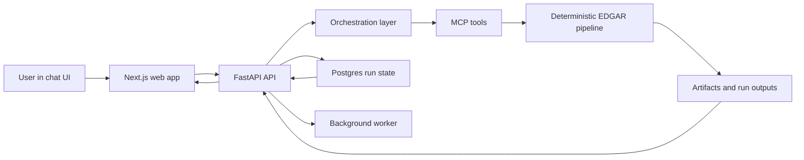

# EDGAR Analysis

EDGAR Analysis is a chat-first financial analysis system built on top of SEC EDGAR data. It combines a deterministic numerical pipeline, a FastAPI control plane, a background worker, and a Next.js interface so you can ask a question like:

> Is MSFT showing persistent deterioration in revenue growth and margin quality over the last 8 quarters?

and get back:

- a readable narrative answer
- inline evidence and charts
- traceable artifacts and run history
- deterministic, inspectable numerical outputs underneath

The core design goal is simple:

**Every analysis run should be trustworthy, inspectable, and reproducible.**

## Product Screens

### Narrative answer with supporting evidence


### Inline chart evidence inside chat


### Deep-dive trace and inspection surface


## Why this repo matters

Most AI-finance demos stop at “LLM says something plausible.” This repo is different:

- **Deterministic numerical path**: the core EDGAR normalization, feature engineering, anomaly detection, peer signals, and trend-break logic live in [`src/`](src/), not inside a black-box model call.
- **Traceable answers**: the chat UI is a product surface over persisted runs, artifacts, and transparency metadata, not an unlogged chat transcript.
- **Evidence-first architecture**: every answer can be traced to stored artifacts, critic/report summaries, and explicit run outputs.
- **Brownfield-ready stack**: FastAPI, SQLAlchemy, Postgres, background worker, and Next.js are already wired together for a real multi-user product path.

## What the product does

- Ask company-level or peer-relative financial questions in a chat UI
- Route prompts deterministically into supported EDGAR analysis plans
- Generate narrative answers with confidence and supporting evidence
- Render inline charts when the backend has safe, deterministic chart previews
- Preserve runs, artifacts, traceability, and audit surfaces for later inspection

## Product architecture



## Tech stack

- **Backend**: FastAPI, SQLAlchemy, Alembic, Postgres
- **Worker**: Python background execution loop with persisted jobs and leases
- **Frontend**: Next.js App Router, React, Tailwind
- **Pipeline**: deterministic Python EDGAR processing in [`src/`](src/)
- **MCP**: shared tool surface in [`edgar_project/mcp/`](edgar_project/mcp/)
- **Evaluation**: benchmark suites and regression checks in [`edgar_project/evaluation/`](edgar_project/evaluation/)

## 5-minute quickstart

### 1. Configure local secrets

From the repository root:

```bash
cp .env.example .env
```

Set these values in `.env`:

- `EDGAR_BACKEND_JWT_SECRET`
- `EDGAR_BACKEND_OPS_API_TOKEN`
- `EDGAR_BACKEND_BOOTSTRAP_ADMIN_TOKEN`

### 2. Start the full stack

```bash
docker compose up --build
```

App endpoints:

- Web: [http://127.0.0.1:3000](http://127.0.0.1:3000)
- API health: [http://127.0.0.1:8000/v1/health](http://127.0.0.1:8000/v1/health)

### 3. Bootstrap the first admin

```bash
curl -sS -X POST "http://127.0.0.1:8000/v1/auth/bootstrap" \
  -H "Content-Type: application/json" \
  -H "X-EDGAR-Bootstrap-Token: $EDGAR_BACKEND_BOOTSTRAP_ADMIN_TOKEN" \
  -d '{"email":"admin@local.dev","password":"your-password-here","display_name":"Local Admin"}'
```

### 4. Sign in to the web app

Open [http://127.0.0.1:3000](http://127.0.0.1:3000), sign in with the bootstrap credentials, create a chat scope, and ask:

```text
Show whether MSFT revenue growth has deteriorated over the last 8 quarters, explain the trend, and include a chart if it materially strengthens the answer.
```

### 5. Verify the stack

```bash
./scripts/smoke-compose.sh
```

For the full local runbook, see [docs/local-stack.md](docs/local-stack.md).

## Fastest demo paths

### Full product path

Use the web app and a fresh chat run.

Good prompts:

- `Is MSFT showing persistent deterioration in revenue growth and margin quality over the last 8 quarters?`
- `Compare AAPL, MSFT, and NVDA on margin trend and tell me which looks weakest.`
- `Show whether MSFT revenue growth has deteriorated over the last 8 quarters, explain the trend, and include a chart if it materially strengthens the answer.`

### Offline numerical demo

If you want to prove the deterministic stack without touching SEC live data:

```bash
PYTHONPATH=. python3 -m edgar_project.cli demo --fixtures
```

### Evaluation suite

```bash
PYTHONPATH=. python3 -m edgar_project.cli evaluate
```

## Trust and inspectability

This repo is strongest when viewed as a system for **auditable financial reasoning**, not just “chat over EDGAR.”

Key trust properties:

- Answers sit on top of persisted runs, not ephemeral model text
- Artifacts are stored and retrievable through the API
- Numerical analysis remains deterministic and inspectable
- Critic/report phases are persisted as explicit surfaces, not hidden
- Run history, trace, artifacts, and evidence all remain available after the answer is rendered

Relevant code paths:

- Deterministic pipeline: [`src/`](src/)
- Backend API: [`backend/api/`](backend/api/)
- Execution services: [`backend/services/`](backend/services/)
- Orchestration: [`edgar_project/orchestration/`](edgar_project/orchestration/)
- Chat UI: [`frontend/src/app/projects/[projectId]/chat/page.tsx`](frontend/src/app/projects/[projectId]/chat/page.tsx)

## Repository map

- [`frontend/`](frontend/): Next.js web app and product UI
- [`backend/`](backend/): FastAPI API, worker, auth, persistence, artifact serving
- [`edgar_project/`](edgar_project/): orchestration, MCP, evaluation, CLI
- [`src/`](src/): deterministic EDGAR computation layer
- [`tests/`](tests/): backend, orchestration, trust, and regression coverage
- [`docs/`](docs/): runbooks and API docs
- [`examples/`](examples/): static example outputs for quick inspection

## Docs

- Local stack: [docs/local-stack.md](docs/local-stack.md)
- Auth and bootstrap: [docs/auth-api.md](docs/auth-api.md)
- Artifact delivery: [docs/artifact-delivery.md](docs/artifact-delivery.md)
- Metric mapping: [docs/metric_mapping.md](docs/metric_mapping.md)
- Examples: [examples/README.md](examples/README.md)

## Testing and CI

This repo already has meaningful verification depth:

- backend pytest suite
- frontend lint + build checks
- compose smoke coverage
- Postgres regression workflow

CI entrypoints:

- [`.github/workflows/ci.yml`](.github/workflows/ci.yml)
- [`.github/workflows/compose-smoke.yml`](.github/workflows/compose-smoke.yml)
- [`.github/workflows/postgres-regressions.yml`](.github/workflows/postgres-regressions.yml)

## Contributing

See [CONTRIBUTING.md](CONTRIBUTING.md).

## Security

See [SECURITY.md](SECURITY.md).

## Community

See [CODE_OF_CONDUCT.md](CODE_OF_CONDUCT.md).

## License

A repository license is still intentionally pending. I did not add one automatically because that is a legal/product decision, not just documentation polish.
