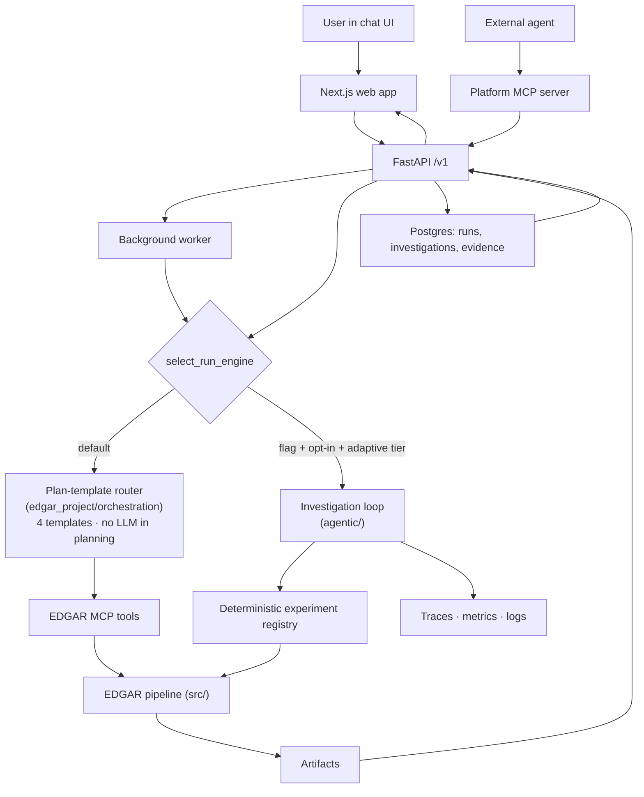
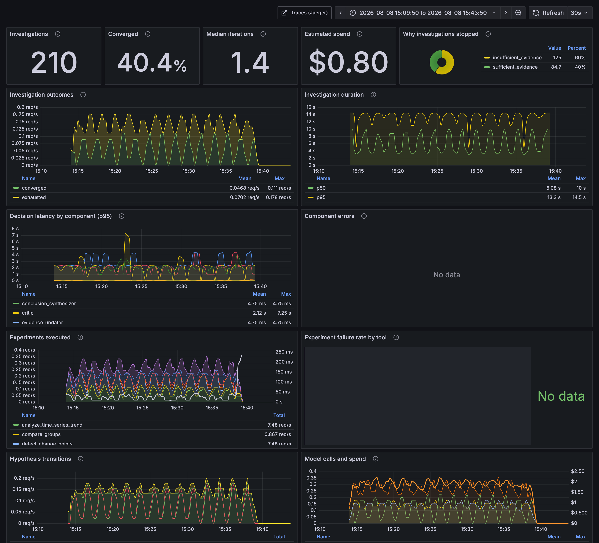
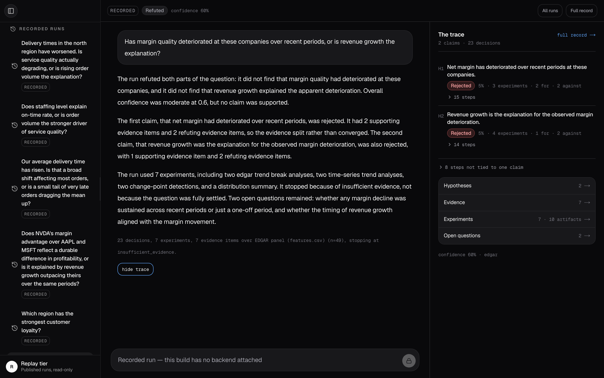
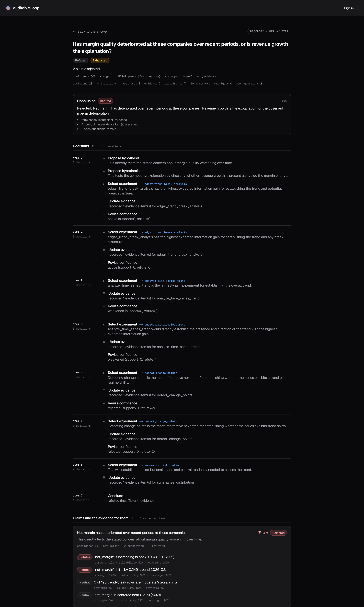
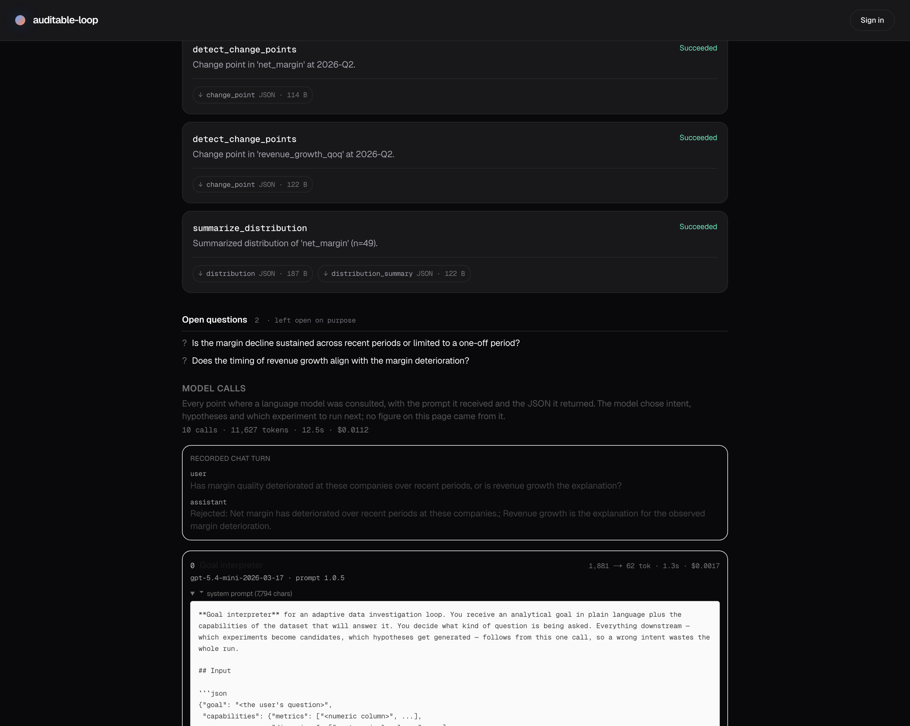

# Agentic Data Science System


An investigation loop that proposes competing explanations, tests each against deterministic
analysis, and can show you every claim it makes back to the number it came from — **and no number
in that chain was written by a language model.**

Two halves. Adaptive reasoning is common; **auditable** adaptive reasoning is the part that took
the work. SEC EDGAR is the flagship dataset, but EDGAR is an adapter, not the architecture.

> **Before you clone:** the recorded runs below are browsable with no account, no key and no
> backend. Running your *own* investigation needs an OpenAI API key — see
> [What you can run](#what-you-can-run).

---

## One investigation, followed all the way down

This is a real run against live SEC filings for AAPL, MSFT and NVDA.

> **Goal:** Has margin quality deteriorated at these companies over recent periods, or is
> revenue growth the explanation?

The loop raised both explanations as separate, falsifiable claims and measured each on its own
metric. Its own evidence went against both:

| Hypothesis | Outcome | Confidence |
|---|---|---|
| Net margin has deteriorated over recent periods | **rejected** | 0.05 |
| Revenue growth is the explanation for the observed deterioration | **rejected** | 0.05 |

**It rejected the premise the question assumed, and then the explanation offered for it.**
Asked to choose between two accounts of a decline, it found the decline itself unsupported —
so neither account had anything to explain. Seven experiments, seven evidence records, and the
answer is that the question was built on something that is not there.

That outcome is reported as `refuted`, not as "inconclusive". Collapsing a run that disproved
its own hypotheses into a failure to conclude gets the strongest thing an investigation can do
exactly backwards.

Two separate facts, and the trace keeps them separate: the **disposition** is `refuted` because
both claims fell, and the **stop reason** is `insufficient_evidence` because the run had
exhausted its candidate experiments rather than reaching a positive finding. It disproved what
it was asked to check; it did not go on to establish what *is* true instead.

### It catches itself holding two claims that cannot both be true

A second SEC run asks whether NVDA's margin advantage is durable profitability **or** faster
revenue growth. Both reached `supported` independently — each scored honestly against its own
evidence, because nothing in the loop compares claims to each other. So the goal's own phrasing
does: a question shaped "is it X, or is it Y?" marks its two claims mutually exclusive before
either is scored, and when both stood the loop recorded the conflict itself:

> The goal asked which of these holds, and both are currently supported […] They cannot both
> be the explanation.

Deterministic code then weakened **both** — the conflict establishes that one of them is wrong,
not which — and the run reports `contradicted` at 0.5 rather than a confident answer at 0.95.
This used to depend on a model noticing the clash at critique time, and
[a published run got through without it](tests/agentic/test_mutual_exclusivity.py): both
branches of an either/or affirmed at 0.95, rendered as the most confident card in the showcase.

Each claim traces down without a gap: conclusion → evidence → the experiment that produced it →
its typed tool envelope → the artifact → the rows. That chain is
[asserted by tests](tests/agentic/test_evidence_provenance_link.py) over a real run and
[again over the read model](tests/test_investigation_evidence_link_readmodel.py), because it is
the product's central claim and it was once quietly false in the published data. The model calls
are audited on the same footing — prompt, response, tokens, cost and latency per phase, at
`GET /v1/runs/{id}/llm-usage`.

> **The LLM plans and interprets. Deterministic code computes.**
> No number in that trace was produced by a language model.

### The same loop, on data that has nothing to do with finance

Four of the runs below analyse an operational delivery dataset — regions, months, delivery
times, order volume. Same loop, same evidence model, same trace surfaces.

That dataset is **generated**, deliberately and with a genuine confound (service times degrade
while volume climbs over the same window). The table says so in the `Data` column rather than
leaving you to guess, and the two EDGAR runs are marked `live` because they are real filings.
A showcase about reporting what you can and cannot support does not get to be vague about its
own inputs.

One of those four is worth its own line. Asked **"which region has the strongest customer
loyalty?"** over a dataset that measures delivery days, order volume, on-time rate and staff
count, the loop stops before running anything:

> This dataset cannot answer the question as asked: the data holds no measure of customer
> loyalty.

Zero experiments, zero claims, `unanswerable_premise`. That is a different answer from "the
evidence was inconclusive", and the distinction is the useful part: one says run more analysis,
the other says bring different data. It used to rank regions by *average delivery days* under a
claim about loyalty and then hedge — the right outcome for the wrong reason, and only because
that proxy happened to be weak.

A run that stops at "I cannot separate these", or at "this is not in here", is a *correct*
outcome. Nearly every AI product on the market will confidently answer a question it cannot
answer.

### Every published run, as recorded

Generated from the committed export by [`scripts/sync-readme-facts.py`](scripts/sync-readme-facts.py)
and checked in CI, because the figures in this file used to be typed by hand and had drifted
from the runs they described.

<!-- BEGIN GENERATED: published-runs -->

| Run | Outcome | Stopped because | Experiments | Evidence | Artifacts | Model calls | Cost | Data |
|---|---|---|---|---|---|---|---|---|
| [`csv-delivery-delays`](frontend/src/lib/demo-static/csv-delivery-delays.json) | **mixed** — one claim stood, one did not | `sufficient_evidence` | 3 | 9 | 5 | 9 | $0.0122 | synthetic |
| [`csv-staffing-vs-service`](frontend/src/lib/demo-static/csv-staffing-vs-service.json) | **contradicted** — two claims could not both be true | `insufficient_evidence` | 1 | 12 | 2 | 4 | $0.0061 | synthetic |
| [`csv-distribution-honesty`](frontend/src/lib/demo-static/csv-distribution-honesty.json) | **declined** — no claim survived the evidence | `insufficient_evidence` | 3 | 6 | 6 | 6 | $0.0078 | synthetic |
| [`edgar-peer-separation`](frontend/src/lib/demo-static/edgar-peer-separation.json) | **contradicted** — two claims could not both be true | `insufficient_evidence` | 3 | 73 | 6 | 8 | $0.0111 | live |
| [`csv-unanswerable-moat`](frontend/src/lib/demo-static/csv-unanswerable-moat.json) | **unanswerable** — the data cannot answer this | `unanswerable_premise` | 0 | 0 | 0 | 2 | $0.0035 | synthetic |
| [`edgar-margin-vs-growth`](frontend/src/lib/demo-static/edgar-margin-vs-growth.json) | **refuted** — the run disproved its own claims | `insufficient_evidence` | 7 | 7 | 10 | 10 | $0.0112 | live |

6 runs, $0.0519 of model spend, 107 of 107 evidence records linked to the experiment that produced them.
1,454 backend tests · 239 frontend tests.

<!-- END GENERATED: published-runs -->

Browse any of them at `/demos`, or read the raw export directly — it is
[the same bytes the API serves](docs/decisions/2026-08-14-static-replay-showcase.md).

---

## What you can run

Three tiers, in increasing order of what they cost you to reach. **Only the third runs a new
investigation, and only the third needs an API key.**

| Tier | What you get | Needs |
|---|---|---|
| **Replay** | Every run in the table above, rendered by the same components an authenticated user sees — answer, claims, evidence, artifacts, and each model call with its prompt and response | Nothing. No account, no key, **no backend** |
| **Deterministic chain** | Ask a question about SEC filings in the chat. A rule-based planner picks one of four analysis templates, runs the EDGAR pipeline, and returns an evidence-linked answer | The stack. An API key only for the written narrative — without one the answer degrades to a stated limitation rather than guessing |
| **Adaptive loop** | The investigation loop this README is about: competing hypotheses, evidence-driven revision, typed termination | The stack, **an OpenAI API key**, and the three gates below |

**The adaptive loop is off by default and needs three independent things**
([`select_run_engine`](backend/services/agentic_investigation_execution_service.py)):
`EDGAR_BACKEND_AGENTIC_ENGINE_ENABLED=true` on the api *and* worker, a run that opts in with
`engine: agentic`, and an account on the `adaptive` tier — which `POST /v1/auth/bootstrap`
grants, and the invite code grants on a public deployment. Any one missing falls back to the
deterministic chain, deliberately: the loop costs real money per question.

**There is no useful offline substitute for the model.** With the flag on and no provider
configured, the loop falls back to [`FixtureAgentPolicy`](agentic/agent/fixture_policy.py) — a
keyword rule engine built for tests. It proposes exactly one hypothesis, so none of the
behaviour above (rival claims, contradiction, `refuted`) can occur. It is there to keep the
loop runnable in CI, not to stand in for a model. This is also precisely what makes the
[agency benchmark](docs/agent/agency-evaluation.md) meaningful: that rule engine is the
baseline the hard tier is *designed* to defeat, and it scores 0%.

### Hosted

_URL pending first deploy._ The replay tier is served from a committed export with no backend.
Live runs, guest sessions and the `/v1` + MCP endpoints need the full stack; see
[docs/deploy.md](docs/deploy.md) for both topologies.

### Locally

Requires **Docker Compose v2.20+** (or Python 3.12 + Node 22 for the manual path).

```bash
cp .env.example .env   # set JWT_SECRET, OPS_API_TOKEN, BOOTSTRAP_ADMIN_TOKEN
docker compose up --build
```

Web on [:3000](http://127.0.0.1:3000), API health on
[:8000/v1/health](http://127.0.0.1:8000/v1/health) — which reports `llm.provider` and
`agentic_engine_enabled`, so you can see which tier you are actually on.

Then create the first admin (this is also what puts you on the `adaptive` tier):

```bash
curl -sS -X POST http://127.0.0.1:8000/v1/auth/bootstrap \
  -H "X-EDGAR-Bootstrap-Token: $EDGAR_BACKEND_BOOTSTRAP_ADMIN_TOKEN" \
  -H 'Content-Type: application/json' \
  -d '{"email":"you@example.com","password":"<32+ chars>","display_name":"You"}'
```

The **chat** at `/projects` runs the deterministic chain. To run the **adaptive loop**, set the
flag on api and worker and `POST /v1/investigations` (or use `/projects/{id}/investigations/new`).
Full runbook: [docs/local-stack.md](docs/local-stack.md).

### With no API key at all

These four are genuinely offline — no network, no provider, safe in a loop:

```bash
PYTHONPATH=. python3 -m edgar_project.cli demo --fixtures   # numerical pipeline on fixtures
PYTHONPATH=. python3 -m edgar_project.cli evaluate          # offline regression suite
PYTHONPATH=. python3 -m agentic.evaluation                  # agency benchmark, core tier
PYTHONPATH=. python3 -m agentic.evaluation --tier hard      # the tier the baseline fails: 0/5
```

`evaluate` defaults to the **offline fixture suite**, which is why it is the normal
**developer fallback** and regression path. Pin one explicitly with `--suite-id suite_fixtures_v1`.

Validation against **live SEC data stays operator-only** and requires an explicit opt-in, so
no default command and no CI job can reach the network by accident:

```bash
PYTHONPATH=. python3 -m edgar_project.cli evaluate --suite-id suite_smoke --allow-live
```

To reproduce a recorded investigation yourself, see
[`scripts/record_demo.py`](scripts/record_demo.py) — it publishes to the replay tier that serves
the runs above.

---

## How it works

**There are two execution paths, and the default is not the loop.** A run is routed by
[`select_run_engine`](backend/services/agentic_investigation_execution_service.py); everything
below the router is shared — same tools, same artifacts, same persistence, same trace surfaces.



The loop ([`agentic/`](agentic/)) interprets a goal, proposes hypotheses, selects an experiment
each iteration, revises claims when evidence contradicts them, critiques its strongest claim,
refuses to conclude while two of its own claims disagree, and stops for an explicit typed
reason. Ten components, each small and deterministic, consuming typed policy decisions.

### How adaptive it actually is

Worth being exact, because "agentic" is a word that has stopped carrying information.

**What the goal decides.** The interpreted intent, metric and grouping decide which experiments
become candidates at all — a ranking goal and a trend goal over the same table run different
tools, and the [agency suite](docs/agent/agency-evaluation.md) has cases that fail if they do not.

**What intermediate results decide.** Hypothesis status drives termination; a claim still at
`proposed` blocks a `sufficient_evidence` stop. A critique can inject a falsification experiment
that was not otherwise a candidate. A detected contradiction weakens both sides and blocks
conclusion outright.

**What is fixed, and should not be oversold.** `expected_information_gain` is a function of the
planner's tool ordering (`0.85 - 0.1 × position`), not of anything measured so far, and
candidates are consumed once run. So the model selects the *order* in which a largely
predetermined candidate set is worked through, plus any falsification the critic adds — it does
not expand that set from what it has learned. In the six published runs the selector departed
from the planner's top-ranked candidate three times out of seventeen. On the scale where 2 is
"router picks a workflow" and 4 is "decomposes goals and revises approach autonomously", this
is a **3**, and the honest version of a 3.

`select_experiment` is also the one model-backed decision the agency suite does *not* cover, for
exactly this reason — [documented here](docs/agent/agency-evaluation.md#what-the-tier-does-not-cover).

| | |
|---|---|
| **Bounded** | Budgets on experiments, iterations, wall time and estimated spend, with deterministic safety caps above them. A public deployment adds per-account and global monthly ceilings ([`spend_guard.py`](backend/services/spend_guard.py)). |
| **Reproducible** | Deterministic IDs and per-iteration checkpoints; a resumed run reaches the same state as an uninterrupted one. `POST /v1/investigations/{id}/replay` re-runs a persisted investigation and returns the diff — `identical`, `same_conclusion` or `diverged`, with per-hypothesis deltas. |
| **Number-safe** | The model may *write* the answer; it may not *state a figure*. Every number in generated prose is checked against the run's recorded values **in the role the sentence puts it in** — `7` passes as an experiment count in a clause about experiments, and is refused next to `% revenue`. One bad figure discards the whole narrative and falls back to the deterministic statement, which reads worse and is entirely true. [`narrative.py`](agentic/agent/narrative.py) |
| **Comparable** | [Replay](docs/agent/replay-and-diff.md) a persisted investigation under a different model, prompt or budget and diff it — did the *answer* change, or only the route to it? |
| **Measured** | [`suite_agency_v2`](docs/agent/agency-evaluation.md) — 13 core + 5 hard cases, 9 properties — scores reasoning quality: does it conclude when evidence supports it, revise when contradicted, decline when it cannot? A hard case is admitted **only if it defeats the deterministic baseline**, so the tier cannot saturate quietly. Baseline 0%, `gpt-5.4-mini` 60%, stable across five trials — [scoreboard](docs/agent/agency-scoreboard.md), including the two cases the model fails and why. |
| **Self-checking** | Each hypothesis is scored against its own evidence, so a claim and its negation can both reach `supported` — one recorded run did exactly that, at 0.95 each. The critic is the only component that sees the supported set together, so it reports the conflict; deterministic code weakens both sides rather than picking one, and the run reports `insufficient_evidence` unless a further experiment settles it. A published demo shows this happening: [`csv-staffing-vs-service`](frontend/src/lib/demo-static/csv-staffing-vs-service.json). |
| **Observable** | Every decision emits an OTel span (`agent.investigation → agent.iteration.N → agent.component.{name}`), a structured log, and Prometheus metrics. → [docs](docs/observability.md) |

`agentic/` depends on nothing in `backend/`. It imports no structlog, no OpenTelemetry, no
Prometheus — instrumentation goes through an [observer seam](agentic/agent/observer.py), and
`agentic/domain` has no SQLAlchemy. The package runs offline, standalone, and is the reason the
same loop works over EDGAR panels and CSV uploads without special-casing either.

### One iteration, verbatim

Every line below is copied from the committed capture of the flagship run
([`edgar-margin-vs-growth.capture.json`](frontend/src/lib/demo-static/edgar-margin-vs-growth.capture.json)),
not reconstructed for the README. This is what "the LLM plans, deterministic code computes"
looks like at the level of one exchange.

**1 — the model is asked what kind of question this is.** It gets the goal and the dataset's
capabilities, nothing else:

```json
{"goal": "Has margin quality deteriorated at these companies over recent periods, or is revenue growth the explanation?",
 "capabilities": {"metrics": ["revenue", "net_income", "…", "revenue_growth_qoq", "net_margin"],
                  "dimensions": [], "entity_column": null, "entities": []}}
```

It returns a typed interpretation — no numbers, no analysis:

```json
{"intent":"trend","metric_hint":"net_margin","group_hint":null,"direction":"down",
 "answerable":true,"unsupported_concept":null,
 "rationale":"The question asks whether margin quality has deteriorated over time, with revenue growth offered as a possible explanation."}
```

**2 — deterministic code notices the question poses alternatives.** `poses_alternatives()`
([`alternatives.py`](agentic/agent/alternatives.py)) matches "**, or is** …" and marks the two
claims mutually exclusive *before either is scored*. No model is consulted, so this cannot be
missed.

**3 — the model proposes the claims**, and a claim may only reference a column the dataset
actually has (an invented `loyalty_score` is dropped rather than silently tested against the
nearest metric):

```json
{"statement":"Net margin has deteriorated over recent periods at these companies.",
 "metric":"net_margin","direction":"down"}
{"statement":"Revenue growth is the explanation for the observed margin deterioration.",
 "metric":"revenue_growth_qoq","direction":"up"}
```

**4 — the planner builds validated candidates; the model picks one index.** That is the entire
extent of its say in what runs. It chose `edgar_trend_break_analysis`.

**5 — deterministic code computes, and produces the first number in the run:**

```json
{"claim": "0 of 196 trend-break rows are moderate/strong shifts.",
 "evidence_type": "trend_break", "direction": "neutral",
 "strength": 0.0, "reliability": 0.867, "coverage": 0.0,
 "statistics": {"sample_size": 196, "effect_size": 0.0, "effect_size_kind": "signal_fraction",
                "diagnostics": {"shift_count": 0.0}},
 "experiment_result_id": "…-res-0", "hypothesis_ids": ["…-hyp-0"]}
```

`experiment_result_id` is the link the whole product rests on: it names the experiment that
produced this row, which names its artifact, which holds the rows. All 107 evidence records
across the six published runs carry one.

**6 — six iterations later, both claims are `rejected` at 0.05** — on evidence like
`'net_margin' is increasing (slope=0.00282, R²=0.19)`, which refutes a claim of deterioration.
The run stops at `insufficient_evidence` (it had exhausted its candidate experiments) and
reports the disposition `refuted` (both claims fell). Those two are different facts and the
trace shows both.

**7 — the model writes the answer, and is not allowed to state a figure.** Its prose says
"2 supporting evidence items and 2 refuting evidence items"; `verify_narrative()` checks each
figure against the recorded counts *in the role the sentence assigns it* and passes it. Had it
written "margins fell 3%", the whole narrative would have been discarded for the deterministic
statement instead.

Total for the run: **10 model calls, 11,627 tokens, 12.5s, $0.0112.**

### Observability



A **seeded local run** — 210 investigations over 30 minutes, $0.80 of tracked spend — not
production traffic. Reproduce it with
[`scripts/seed-agent-activity.py`](scripts/seed-agent-activity.py).

The panels answer whether the loop is *working*: median iterations 1.4 (it iterates rather than
one-shotting), seven distinct tools with the mix shifting by goal (it adapts), and hypothesis
transitions including `→ rejected` (its own evidence overturns its claims). `Component errors`
reads "No data" because nothing failed across those 210 runs — left as-is rather than
manufactured.

The Grafana/Prometheus/Jaeger stack is **local-only**
(`docker-compose.observability.yml`); the hosted demo does not run it.

### Product surfaces

The answer, with the trace beside it — every claim expandable down to the evidence for it:



The full record. Every decision the loop made, in order, then each claim with the evidence for
and against it and the strength, reliability and coverage of each item:



Further down the same page: the artifacts each experiment emitted, the questions it left open on
purpose, and **every model call with its system prompt, its input, its output, tokens, latency
and cost.** The model chose intent, hypotheses and which experiment to run next; no figure on
that page came from it.



All three are the `/demos` replay tier, which needs no account, no key and no backend — so you
can check the claims in this README against the record yourself.

### Integration

Everything goes through `/v1` — there is no privileged back door, which is why the MCP server
can be hosted safely.

- **HTTP API** — committed OpenAPI contract at [`docs/api/openapi.json`](docs/api/openapi.json),
  enforced in CI → [contract docs](docs/api/README.md)
- **Platform MCP server** — commission investigations and read hypotheses, evidence and
  artifacts as MCP tools, with conclusions and artifacts also exposed as MCP *resources*;
  stdio or hosted streamable-HTTP with per-caller bearer auth
  → [docs](docs/mcp-platform-server.md)
- **EDGAR MCP server** — the deterministic computation tools
  → [`edgar_project/mcp/`](edgar_project/mcp/)
- **Extending it** — add an input adapter, experiment tool, or decision policy
  → [guide](docs/extending.md)

---

## Known limits

Stated plainly, because a system that reports uncertainty honestly should do the same about
itself.

- **Declining an unanswerable question is still a model judgement.** `answerable: false` is
  reported by the goal interpreter, and everything after it is deterministic — the loop stops,
  claims nothing, runs nothing. But a premise the model does not notice is broken is not
  caught, and the failure is quiet: the loop measures a proxy and reports it honestly, which
  looks identical to an answer. Both directions cost something. Over-declining a question the
  data *can* address is equally bad, and it happened during development — an EDGAR panel has
  no `dimension` columns, so a goal comparing three tickers looked unanswerable until the
  interpreter was shown the entity column it had never been given.
- **The loop selects the order of a largely fixed candidate set, not the set itself.** See
  [how adaptive it actually is](#how-adaptive-it-actually-is). The same fact is why a fair agency
  case for `select_experiment` is not constructible, leaving two of the loop's four model-backed
  decisions covered by the suite —
  [documented here](docs/agent/agency-evaluation.md#what-the-tier-does-not-cover).
- **An investigation needs a model provider; there is no offline equivalent.** Without one the
  loop runs on a keyword rule engine written for tests, which proposes a single hypothesis — so
  it terminates honestly and says almost nothing. The deterministic *computation* is genuinely
  offline; the *reasoning* is not. See [what you can run](#what-you-can-run).
- **Mutual exclusivity is detected from the goal's phrasing, not from meaning.** A question
  shaped "is it X, or is it Y?" marks its claims as rivals deterministically, before either is
  scored — so the common case no longer depends on a model noticing. Two claims that are
  genuinely incompatible but *not* posed as alternatives still fall to the critic, which is
  best-effort: it catches the obvious cases, not all of them. The detector is deliberately
  conservative, because inventing a conflict would suppress a legitimate "both are true".
- **The narrative check trades readability for safety, and the trade is real.** Prose stating a
  figure the run did not record is discarded whole, and a figure with nothing naming what it
  counts is treated as unrecorded. Tightening it too far discarded four of six real narratives
  during development; the corpus of every narrative this loop has written is now a test, in
  both directions.
- **The agentic engine is off by default** (`EDGAR_BACKEND_AGENTIC_ENGINE_ENABLED`); the
  deterministic EDGAR chain is the default execution path. The hosted demo enables it for
  invite-code accounts only, because the loop costs real money per question.
- **The hosted MCP handshake/tool-listing is unauthenticated** (tool *invocation* is not,
  and every tool call is rate-limited per caller —
  [`rate_limit.py`](backend/mcp/rate_limit.py)). The handshake exposes schema only, which is
  normal for MCP; bind it to loopback behind a reverse proxy to close it.
- **No backup/restore runbook.** A [deliberate scope decision](docs/decisions/2026-08-11-showcase-direction.md)
  for a demo with no user data worth recovering, not an oversight. It reopens first if this ever
  takes real users.
- **Single replica.** Auth rate limiting is in-process
  ([`rate_limit.py`](backend/api/rate_limit.py)); a second API replica would enforce it
  independently.

---

## Repository map

| | |
|---|---|
| [`agentic/`](agentic/) | the investigation loop, domain model, adapters, experiment registry |
| [`src/`](src/) | deterministic EDGAR computation — no LLM touches this path |
| [`backend/`](backend/) | FastAPI `/v1`, worker, auth, persistence, artifact delivery, platform MCP |
| [`edgar_project/`](edgar_project/) | orchestration, EDGAR MCP tools, evaluation, CLI |
| [`frontend/`](frontend/) | Next.js web app |
| [`ops/`](ops/) | Grafana dashboard, Prometheus alert rules, Caddy config |
| [`tests/`](tests/) | backend, orchestration, agency, regression, boundary and contract suites — counts in the table above |

**Docs:** [local stack](docs/local-stack.md) · [deploy](docs/deploy.md) ·
[performance](docs/performance.md) ·
[architecture](docs/architecture/) · [the loop](docs/agent/investigation-loop.md) ·
[observability](docs/observability.md) · [auth](docs/auth-api.md) ·
[artifact delivery](docs/artifact-delivery.md) · [extending](docs/extending.md)

**Direction:** [docs/decisions/2026-08-11-showcase-direction.md](docs/decisions/2026-08-11-showcase-direction.md)
records what this is being built as, and what that rules out.

## Contributing · Security · License

[CONTRIBUTING.md](CONTRIBUTING.md) · [SECURITY.md](SECURITY.md) ·
[CODE_OF_CONDUCT.md](CODE_OF_CONDUCT.md) · MIT ([LICENSE](LICENSE))
