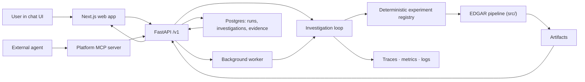

# Agentic Data Science System


An agent that investigates a dataset adaptively, and can show you every step of its reasoning
back to the number it came from.

Two halves. Adaptive reasoning is common; **auditable** adaptive reasoning is the part that took
the work. SEC EDGAR is the flagship dataset, but EDGAR is an adapter, not the architecture.

---

## One investigation, followed all the way down

This is a real run against live SEC filings for AAPL, MSFT and NVDA. It cost **$0.0101**.

> **Goal:** Has margin quality deteriorated at these companies over recent periods, or is
> revenue growth the explanation?

The loop raised both explanations as separate, falsifiable claims and measured each on its own
metric:

| Hypothesis | Outcome | Confidence |
|---|---|---|
| Net margin has deteriorated over the recent periods | **rejected** | 0.05 |
| Revenue growth is the explanation for the observed margin change | **supported** | 0.95 |

**It rejected the premise the question assumed.** Asked to choose between two explanations, it
found against the one the phrasing took for granted.

What it took to get there: **7 experiments**, 7 evidence records, 10 artifacts, 11 model calls,
terminating `sufficient_evidence` with the conclusion marked `mixed` — because one claim landed
and one did not, and rounding that to the supported half would be a lie.

`edgar_trend_break_analysis` led the run. The experiment sequence is a function of intermediate
results, not a fixed script: had the first result gone the other way, the follow-ups would
differ.

Then it argued against its own finding. The critic challenged the **supported** claim — not the
rejected one — asking whether the support was an artefact of skew or outliers rather than a
stable pattern, and nominated `summarize_distribution` to test it. **The loop ran that tool.** A
critique the loop never acts on is a note, not a challenge, so the distinction is enforced in
the [agency suite](docs/agent/agency-evaluation.md) rather than left to good intentions.

Every claim above traces down without a gap: conclusion → evidence → the experiment that
produced it → its typed tool envelope → the artifact → the rows. The model calls are audited on
the same footing — prompt, response, tokens, cost and latency per phase, at
`GET /v1/runs/{id}/llm-usage`.

> **The LLM plans and interprets. Deterministic code computes.**
> No number in that trace was produced by a language model.

### The same loop, on data that has nothing to do with finance

A second recorded investigation runs over an operational delivery dataset — regions, months,
delivery times, order volume. Same loop, same evidence model, same trace surfaces.

It ends differently, and that is the point. Both claims came back **weakened**, terminating
`insufficient_evidence`: the dataset was built with a genuine confound (service times degrade
while volume climbs over the same window), and the loop declined to pick a winner it could not
justify. Twelve evidence records, six experiments, one critique acted on, $0.0121.

A run that stops at "I cannot separate these" is a *correct* outcome here, not a failed one.
Nearly every AI product on the market will confidently answer a question it cannot answer.

---

## Try it

**Hosted showcase:** _URL pending first deploy._ Both investigations above are browsable at
`/demos` — the real persisted runs, rendered by the same components an authenticated user
sees, served from a committed export with **no backend**. Live runs, guest sessions and the
`/v1` + MCP endpoints need the full stack; see [docs/deploy.md](docs/deploy.md) for both
topologies.

Locally, the whole stack is one command:

```bash
cp .env.example .env   # set JWT_SECRET, OPS_API_TOKEN, BOOTSTRAP_ADMIN_TOKEN
docker compose up --build
```

Web on [:3000](http://127.0.0.1:3000), API health on
[:8000/v1/health](http://127.0.0.1:8000/v1/health). Bootstrap an admin, then ask a question in
the chat. Full runbook: [docs/local-stack.md](docs/local-stack.md).

**No API key? The deterministic core runs offline:**

```bash
PYTHONPATH=. python3 -m edgar_project.cli demo --fixtures   # numerical pipeline on fixtures
PYTHONPATH=. python3 -m edgar_project.cli evaluate          # offline regression suite
PYTHONPATH=. python3 -m agentic.evaluation                  # agency benchmark
```

`evaluate` defaults to the **offline fixture suite**, which is why it is the normal
**developer fallback** and regression path — it touches no network and is safe to run in a
loop. Pin one explicitly with `--suite-id suite_fixtures_v1`.

Validation against **live SEC data stays operator-only** and requires an explicit opt-in, so
no default command and no CI job can reach the network by accident:

```bash
PYTHONPATH=. python3 -m edgar_project.cli evaluate --suite-id suite_smoke --allow-live
```

To reproduce a recorded investigation yourself, see
[`scripts/record_demo.py`](scripts/record_demo.py) — it publishes to the replay tier that serves
the demo above.

---

## How it works



The loop ([`agentic/`](agentic/)) interprets a goal, proposes hypotheses, chooses experiments
from what it has learned so far, revises claims when evidence contradicts them, critiques its
strongest claim, and stops for an explicit typed reason. Ten components, each small and
deterministic, consuming typed policy decisions.

| | |
|---|---|
| **Bounded** | Budgets on experiments, iterations, wall time and estimated spend, with deterministic safety caps above them. A public deployment adds per-account and global monthly ceilings ([`spend_guard.py`](backend/services/spend_guard.py)). |
| **Reproducible** | Deterministic IDs and per-iteration checkpoints; a resumed run reaches the same state as an uninterrupted one. |
| **Comparable** | [Replay](docs/agent/replay-and-diff.md) a persisted investigation under a different model, prompt or budget and diff it — did the *answer* change, or only the route to it? |
| **Measured** | [`suite_agency_v1`](docs/agent/agency-evaluation.md) scores reasoning quality: does it conclude when evidence supports it, revise when contradicted, decline when it cannot? On the hard tier the deterministic baseline scores 0% and `gpt-5.4-mini` 60%, stable across five trials — [scoreboard](docs/agent/agency-scoreboard.md). |
| **Observable** | Every decision emits an OTel span (`agent.investigation → agent.iteration.N → agent.component.{name}`), a structured log, and Prometheus metrics. → [docs](docs/observability.md) |

`agentic/` depends on nothing in `backend/`. It imports no structlog, no OpenTelemetry, no
Prometheus — instrumentation goes through an [observer seam](agentic/agent/observer.py), and
`agentic/domain` has no SQLAlchemy. The package runs offline, standalone, and is the reason the
same loop works over EDGAR panels and CSV uploads without special-casing either.

### Observability


A **seeded local run** — 210 investigations over 30 minutes, $0.80 of tracked spend — not
production traffic. Reproduce it with
[`scripts/seed-agent-activity.py`](scripts/seed-agent-activity.py).

The panels answer whether the loop is *working*: median iterations 1.4 (it iterates rather than
one-shotting), seven distinct tools with the mix shifting by goal (it adapts), and hypothesis
transitions including `→ rejected` (its own evidence overturns its claims). `Component errors`
reads "No data" because nothing failed across those 210 runs — left as-is rather than
manufactured.

The Grafana/Prometheus/Jaeger stack is **local-only**
(`docker-compose.observability.yml`); the hosted demo does not run it.

### Product surfaces

| Narrative answer | Inline chart evidence | Deep-dive trace |
|---|---|---|
|  |  |  |

### Integration

Everything goes through `/v1` — there is no privileged back door, which is why the MCP server
can be hosted safely.

- **HTTP API** — committed OpenAPI contract at [`docs/api/openapi.json`](docs/api/openapi.json),
  enforced in CI → [contract docs](docs/api/README.md)
- **Platform MCP server** — commission investigations, read hypotheses, evidence and artifacts
  as MCP tools and resources; stdio or hosted streamable-HTTP with per-caller bearer auth
  → [docs](docs/mcp-platform-server.md)
- **EDGAR MCP server** — the deterministic computation tools
  → [`edgar_project/mcp/`](edgar_project/mcp/)
- **Extending it** — add an input adapter, experiment tool, or decision policy
  → [guide](docs/extending.md)

---

## Known limits

Stated plainly, because a system that reports uncertainty honestly should do the same about
itself.

- **The model is the weak link, not the loop.** On a benchmark case where the honest answer is
  "this data cannot answer that", `gpt-5.4-mini` substitutes the nearest available metric and
  reports confidence 0.95 — indistinguishable from the rule-engine baseline.
- **Two of the loop's four model-backed decisions are covered by the agency suite.** A fair case
  for `select_experiment` is not constructible, because `expected_information_gain` is fixed by
  the planner's tool ordering —
  [documented here](docs/agent/agency-evaluation.md#what-the-tier-does-not-cover).
- **The agentic engine is off by default** (`EDGAR_BACKEND_AGENTIC_ENGINE_ENABLED`); the
  deterministic EDGAR chain is the default execution path. The hosted demo enables it for
  invite-code accounts only, because the loop costs real money per question.
- **The hosted MCP handshake/tool-listing is unauthenticated** (tool *invocation* is not,
  and every tool call is rate-limited per caller —
  [`rate_limit.py`](backend/mcp/rate_limit.py)). The handshake exposes schema only, which is
  normal for MCP; bind it to loopback behind a reverse proxy to close it.
- **No backup/restore runbook.** A [deliberate scope decision](docs/decisions/2026-08-11-showcase-direction.md)
  for a demo with no user data worth recovering, not an oversight. It reopens first if this ever
  takes real users.
- **Single replica.** Auth rate limiting is in-process
  ([`rate_limit.py`](backend/api/rate_limit.py)); a second API replica would enforce it
  independently.

---

## Repository map

| | |
|---|---|
| [`agentic/`](agentic/) | the investigation loop, domain model, adapters, experiment registry |
| [`src/`](src/) | deterministic EDGAR computation — no LLM touches this path |
| [`backend/`](backend/) | FastAPI `/v1`, worker, auth, persistence, artifact delivery, platform MCP |
| [`edgar_project/`](edgar_project/) | orchestration, EDGAR MCP tools, evaluation, CLI |
| [`frontend/`](frontend/) | Next.js web app |
| [`ops/`](ops/) | Grafana dashboard, Prometheus alert rules, Caddy config |
| [`tests/`](tests/) | 1,177 tests: backend, orchestration, agency, regression |

**Docs:** [local stack](docs/local-stack.md) · [deploy](docs/deploy.md) ·
[performance](docs/performance.md) ·
[architecture](docs/architecture/) · [the loop](docs/agent/investigation-loop.md) ·
[observability](docs/observability.md) · [auth](docs/auth-api.md) ·
[artifact delivery](docs/artifact-delivery.md) · [extending](docs/extending.md)

**Direction:** [docs/decisions/2026-08-11-showcase-direction.md](docs/decisions/2026-08-11-showcase-direction.md)
records what this is being built as, and what that rules out.

## Contributing · Security · License

[CONTRIBUTING.md](CONTRIBUTING.md) · [SECURITY.md](SECURITY.md) ·
[CODE_OF_CONDUCT.md](CODE_OF_CONDUCT.md) · MIT ([LICENSE](LICENSE))
